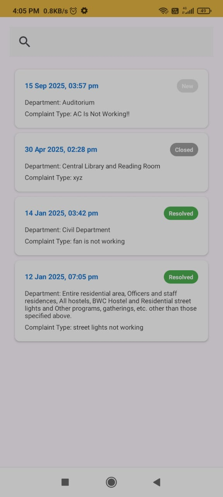

# Electrifix - Electrical Maintenance Workflow App

Electrifix is an Android application designed to **digitize electrical maintenance workflows** in educational institutions. The app enables **real-time complaint reporting, tracking, and resolution** with role-based access for students and admins.

---

## **Features**
- **Role-based Access:** Separate interfaces for **Students** and **Admins**.
- **Real-time Complaint Reporting:** Students can register complaints about electrical issues instantly.
- **Complaint Tracking:** Students can track the status of their complaints.
- **Admin Assignment:** Admins can assign complaints to maintenance staff and update their status.
- **Cloud-based Storage:** All data is synced in real-time using **Firebase Firestore**.
- **Authentication:** Secure login and signup using **Firebase Authentication**.
- **Clean and Intuitive UI:** Designed in XML for a smooth user experience.

---

## **Technologies Used**
- **Android Studio**  
- **Java**  
- **XML (for UI design)**  
- **Firebase Authentication**  
- **Firebase Firestore**  

---

## **Screenshots**

### **Login / Signup**


### **Complaint Registration**



### **Complaint Tracking**


### **Dashboards**


### **Status and Remark**


### **Complaint PDF**


> ⚠️ Replace the placeholders in `screenshots/` with actual images from your app.

---

## **Installation**
1. Clone this repository:  
```bash
git clone https://github.com/YourUsername/Electrifix-App.git
